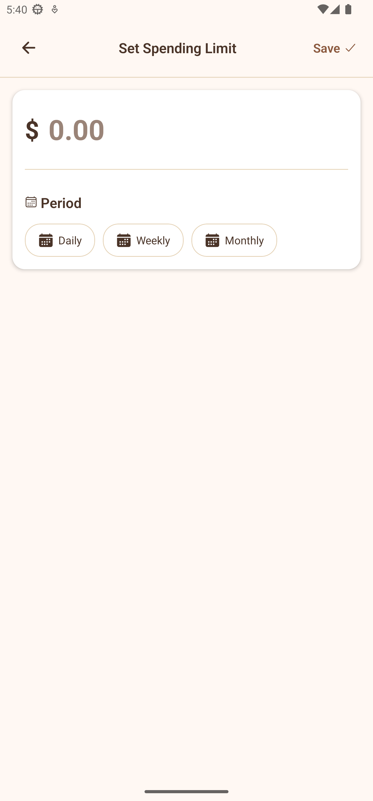
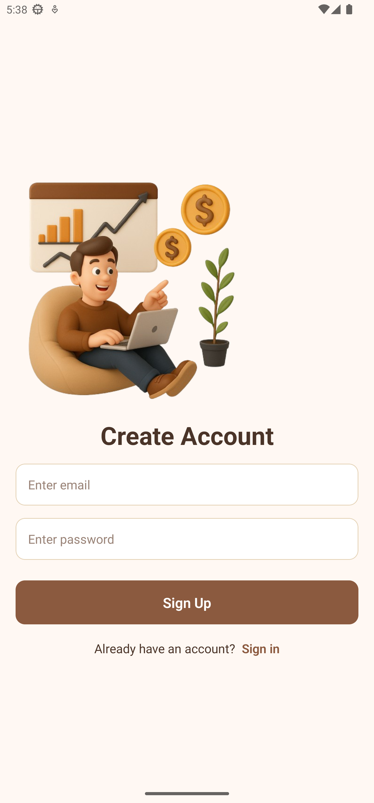
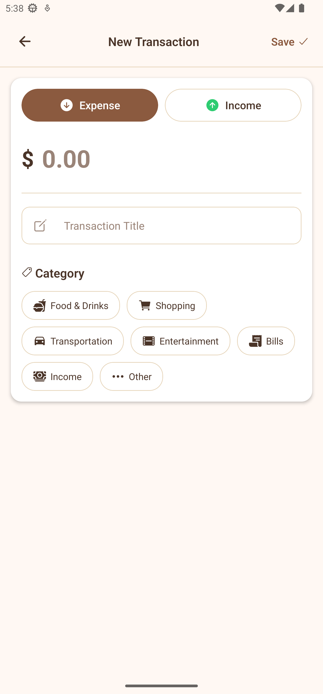
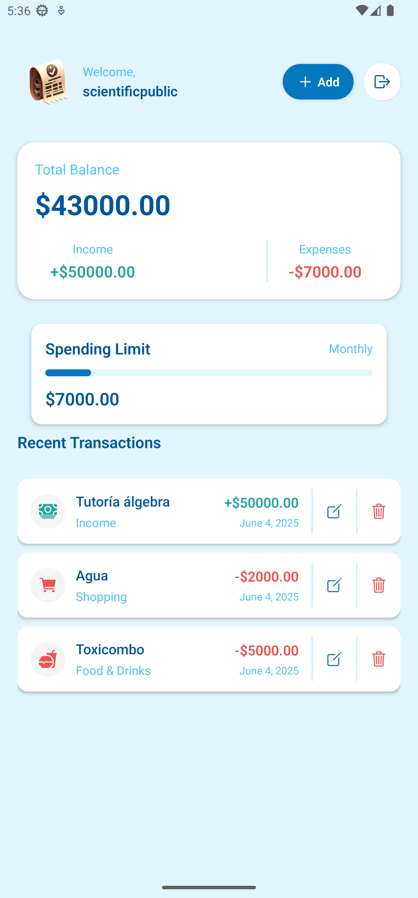
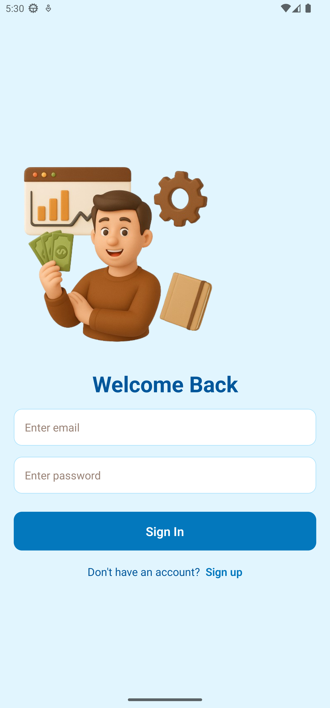

# React Native Wallet App

A modern mobile wallet application built with React Native and Expo, providing a seamless experience for managing digital assets and transactions.

## Features

- Secure wallet management
- Transaction history
- Asset tracking
- Modern and intuitive UI
- Cross-platform support (iOS & Android)

## Technology Stack

### Frontend
- React Native with Expo
- TypeScript for type safety
- React Navigation for routing
- React Query for data fetching
- Zustand for state management

### Backend & Infrastructure
- **Database**: NeonDB with PostgreSQL for reliable data storage
- **Caching**: Redis with Upstash for high-performance caching
- **Authentication**: Clerk for secure user authentication and management
- **Hosting**: Render for scalable backend deployment
- **API**: RESTful architecture with Express.js

### Development Tools
- ESLint for code linting
- Prettier for code formatting
- Jest for testing
- GitHub Actions for CI/CD

## Preview

### Screenshots

<div style="display: flex; flex-wrap: wrap; gap: 16px; margin: 20px 0;">
  
  
  
  
  
</div>

## Getting Started

### Prerequisites

- Node.js (v16 or higher)
- npm or yarn
- Expo CLI
- iOS Simulator (for Mac) or Android Studio (for Android development)

### Installation

1. Clone the repository
   ```bash
   git clone [repository-url]
   cd react-native-wallet
   ```

2. Install dependencies
   ```bash
   npm install
   ```

3. Start the development server
   ```bash
   npx expo start
   ```

### Development Options

You can run the app using any of these methods:
- iOS Simulator (Mac only)
- Android Emulator
- Physical device using Expo Go
- Web browser (limited functionality)

## Project Structure

```
mobile/
├── app/              # Main application code
├── assets/           # Static assets
├── components/       # Reusable components
├── constants/        # App constants
├── hooks/           # Custom React hooks
├── services/        # API and external services
├── store/           # State management
└── utils/           # Utility functions
```

## Contributing

1. Fork the repository
2. Create your feature branch (`git checkout -b feature/amazing-feature`)
3. Commit your changes (`git commit -m 'Add some amazing feature'`)
4. Push to the branch (`git push origin feature/amazing-feature`)
5. Open a Pull Request

## License

This project is licensed under the MIT License - see the LICENSE file for details.

## Support

For support, please open an issue in the GitHub repository or contact the development team.
